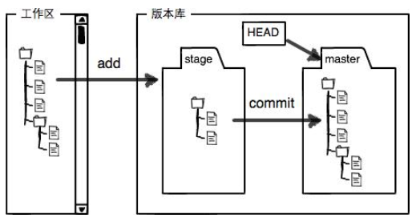

## 用户信息配置
```bash
# 第一次安装git 后需要进行配置
$ git config --global user.name "T_Cutter"
$ git config --global user.email "786753417@qq.com"

# --global 表示机器上所有仓库（repository）都会使用这个配置；去掉--global只对当前仓库有效
```

## 本地仓库
### 创建repository
```bash
$ git init   
```
生成隐藏的 .git 目录，当前目录变成一个仓库

### 在当前目录下创建 readme.md文件

### 本地仓库状态
```bash
$ git status
```
查看本地仓库的状态，文件的修改，暂存等操作都能看到

### 查看修改记录
```bash
$ git diff readme.md
```
查看readme.md文件的修改记录

```bash
$ git diff HEAD -- readme.md
```
查看工作区和版本库里面最新版本的区别

### 命令日志
```bash
$ git log 
```
显示最近commit操作的日志

```bash
$ git reflog
```
显示最近所有操作的日志

### 版本回退
```bash
$ git reset --hard HEAD^
$ git reset --hard 36134533
```
回退到指定的 *commit* 版本，*HEAD* 表示当前版本，*HEAD~1* （或 *HEAD^*）表示上一个版本, *36134533* 为 *commit id*

### 工作区和暂存区



比如 *TCutter.github.io* 就是一个工作区，*.git* 就是 Git 的版本库，Git为我们自动创建的第一个分支 *master*，以及指向 *master* 的一个指针叫 *HEAD*

### 添加修改至暂存区
```bash
$ git add readme.md     # 添加指定文件
$ git add .     # 添加所有修改
``` 

### 提交修改至本地Git服务器
```bash
$ git commit -m "submit modified files to server"
```
把暂存区的所有内容提交到当前分支。*-m* 表示注释

### 撤销修改
```bash
$ git checkout -- readme.md
```
1. *readme.md* 自修改后还没有被放到暂存区，现在，撤销修改就回到和版本库一模一样的状态；
2. *readme.md* 已经添加到暂存区后，又作了修改，现在，撤销修改就回到添加到暂存区后的状态

```bash
$ git reset HEAD readme.md
```
把暂存区的修改撤销掉（unstage），重新放回工作区。

现在暂存区是干净的，工作区有修改


- 场景1：当你改乱了工作区某个文件的内容，想直接丢弃工作区的修改时，用命令git checkout -- file

- 场景2：当你不但改乱了工作区某个文件的内容，还添加到了暂存区时，想丢弃修改，分两步，第一步用命令git reset HEAD file，就回到了场景1，第二步按场景1操作

- 场景3：已经提交了不合适的修改到版本库时，想要撤销本次提交，参考 *版本回退* 一节，不过前提是没有推送到远程库

### 删除文件
```bash
$ rm readme.md  # 1.在文件管理器中删除
$ git rm readme.md  # 2. Git上提交删除命令
$ git commit -m "remove readme.md" # 3. git commit
```

## 远程仓库
### [配置SSH Key](https://blog.csdn.net/u014343528/article/details/48787221)

由于本地Git仓库和GitHub仓库之间的传输是通过SSH加密的，因此在使用之前需要先配置

### 添加远程库
```bash
$ git remote add origin git@github.com:TCutter/TCutter.github.io.git
```

把一个已有的本地仓库与远程库关联

```bash
$ git push -u origin master
```
把本地仓库的内容推送到GitHub远程库

我们第一次推送master分支时，加上了-u参数，Git不但会把本地的master分支内容推送到远程新的master分支，还会把本地的master分支和远程的master分支关联起来，在以后的推送或者拉取时就可以简化命令

### 克隆远程库
```bash
$ git clone git@github.com:TCutter/TCutter.github.io.git
```

## 分支管理
