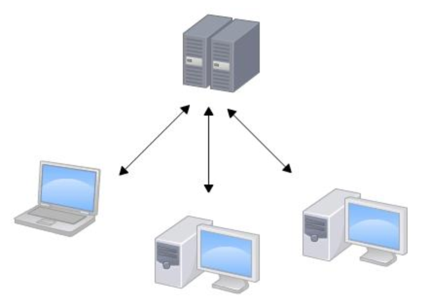
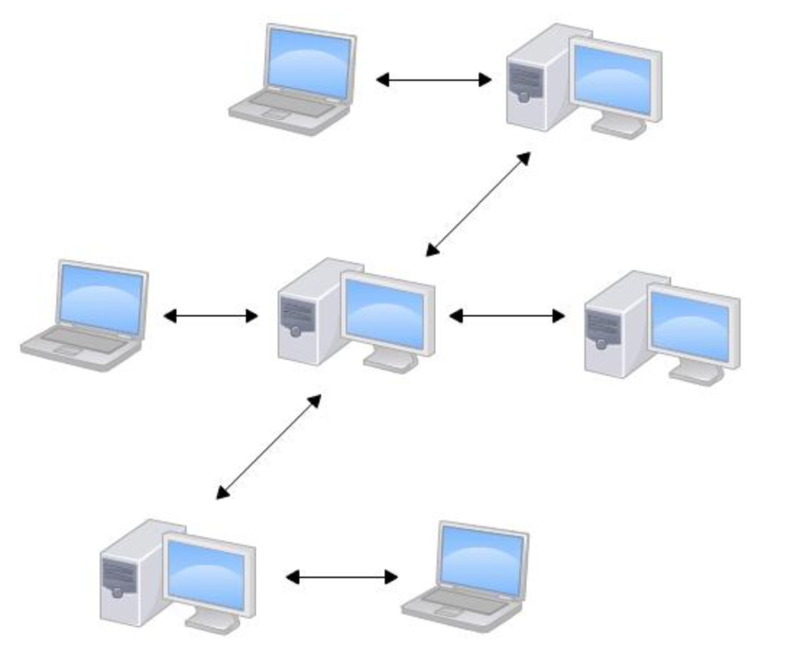

<!-- TOC -->

- [Git](#git)
  - [集中式 VS 分布式](#集中式-vs-分布式)
    - [集中式](#集中式)
    - [分布式](#分布式)
  - [分支管理](#分支管理)
  - [参考链接](#参考链接)

<!-- /TOC -->
## Git
概念：分布式版本控制系统
版本控制：对代码、文档的变更进行管理

### 集中式 VS 分布式

#### 集中式
版本库集中放置在中央服务器

#### 分布式
每个人的电脑都有完整的版本库

### 分支管理

### 参考链接
[Git教程 - 廖雪峰的官方网站](https://www.liaoxuefeng.com/wiki/896043488029600)